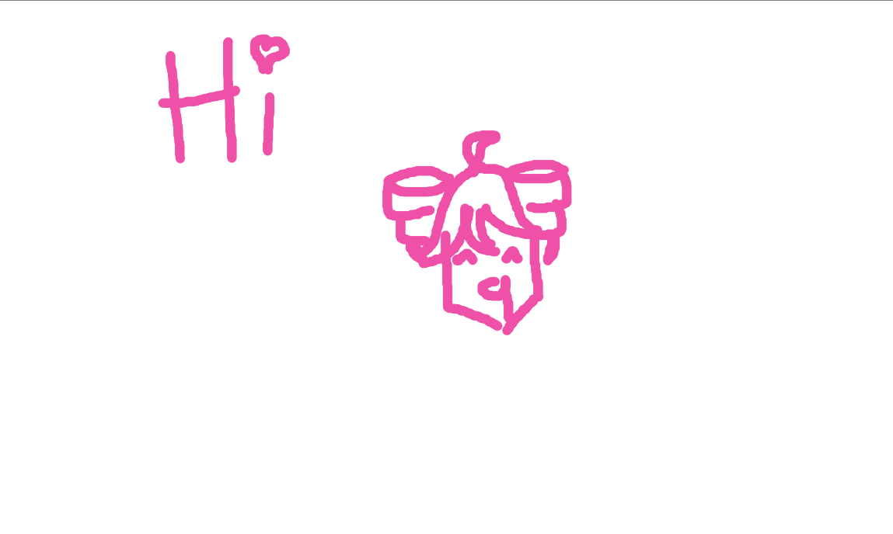

# Alla Skriv
A 1920x1080 shared canvas with everyone!

Try it here: https://alla-skriv.netlify.app/

Run the server by running `server.py`, you need `simple_websocket_server` installed from pip though

Features:
- You can draw
- If you right click you can change settings like brush size, color, and if youre using a marker or pencil
- Ctrl+Z to undo a stroke, or use the settings menu to click the undo button
- Your drawing and every elses are synced together